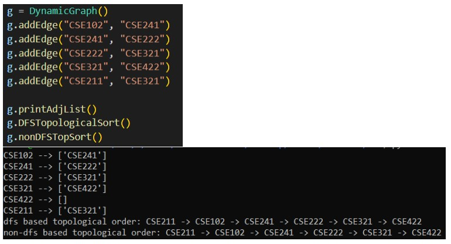
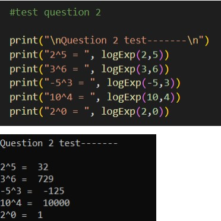
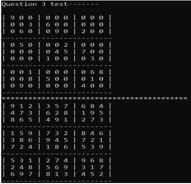

# General
- Detailed explanations of the algorithms are in the doc file.  
- All algorithms can be tested using test menu.

# RUN
```python driver.py```  

# DFS and NON-DFS Based Topological Sort - O(V+E)


# Exponential Calculation Algorithm - O(log(n))


# Brute Force 9x9 Sudoku Solver - O(9^E)
- E is the number of empty cells in the sudoku board.

