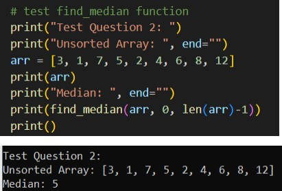

# General
- Detailed explanations of the algorithms are in the doc file.  
- All algorithms can be tested using test menu.

# RUN
```python driver.py```  

# Brute Force Route Game Algorithm - O(2^(n+m))
  


# Decrease and Conquer Algorithm to Find Median Of Unsorted Array - O(n)(average case)
- Best case is O(n)    
- Worst case is O(n^2)  
  


# Josephus Game Circular Linked List Solution - O(n)


# Josephus Game Decrease and Conquer Solution - O(logn)
