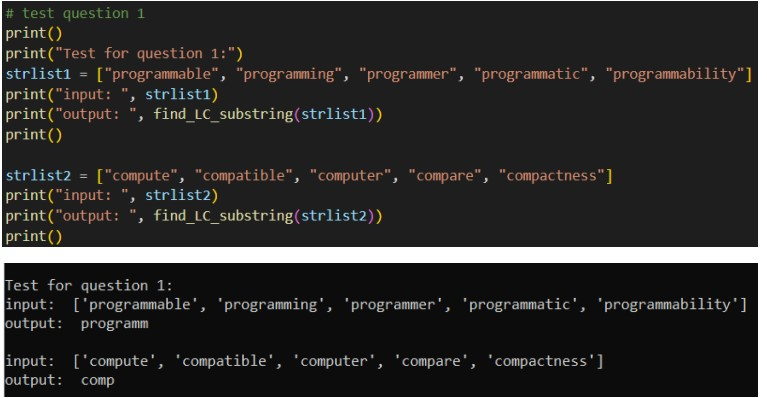
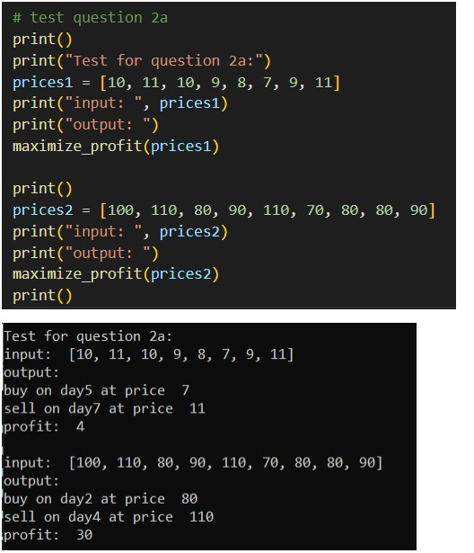
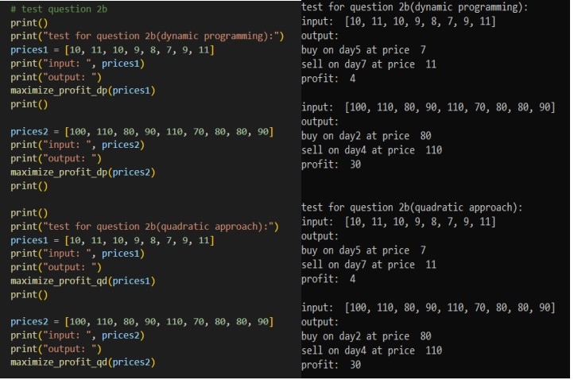
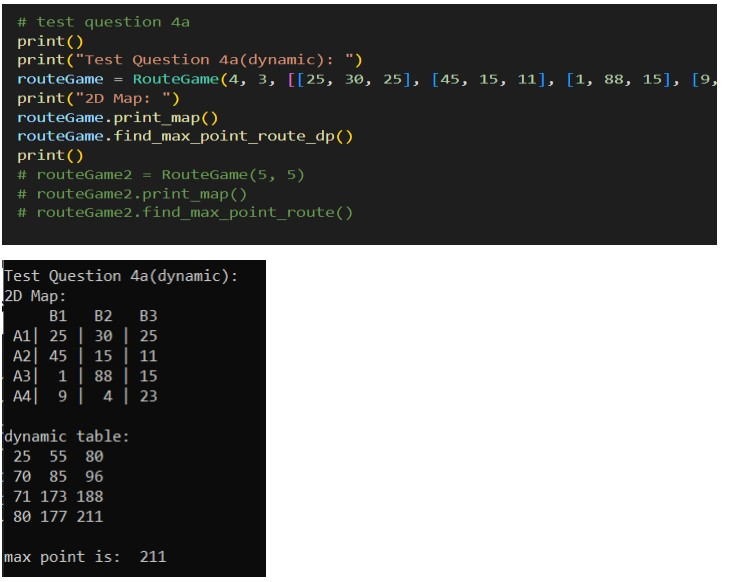
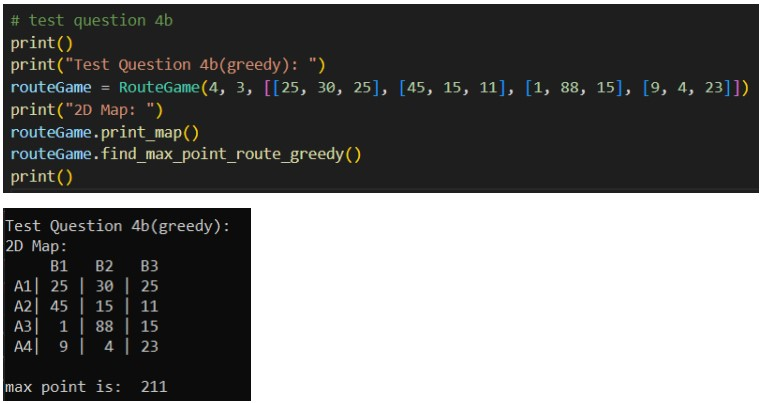

# General
- Detailed explanations of the algorithms are in the doc file.  
- All algorithms can be tested using test menu.

# RUN
```python driver.py```  

# Divide and Conquer Largest Common Substring - O(m*n)


# Divide and Conquer Maximize Profit - O(n)
 
  
# DP and Naive Maximize Profit
- DP : O(n)  
- Naive : O(n^2)  
  


# Route Game with Dynamic Programming - O(m*n)  
- m is row, n is column  
  
  

# Route Game with Greedy Algorithm - O(m+n)  
- m is row, n is column  
  
  